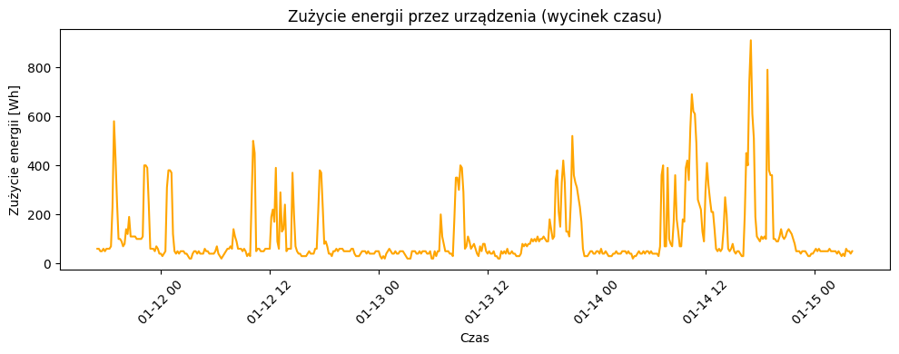
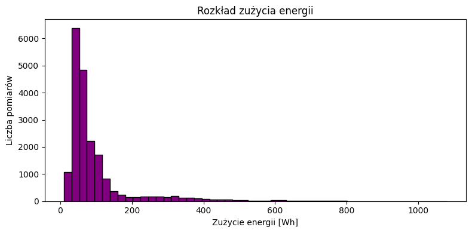
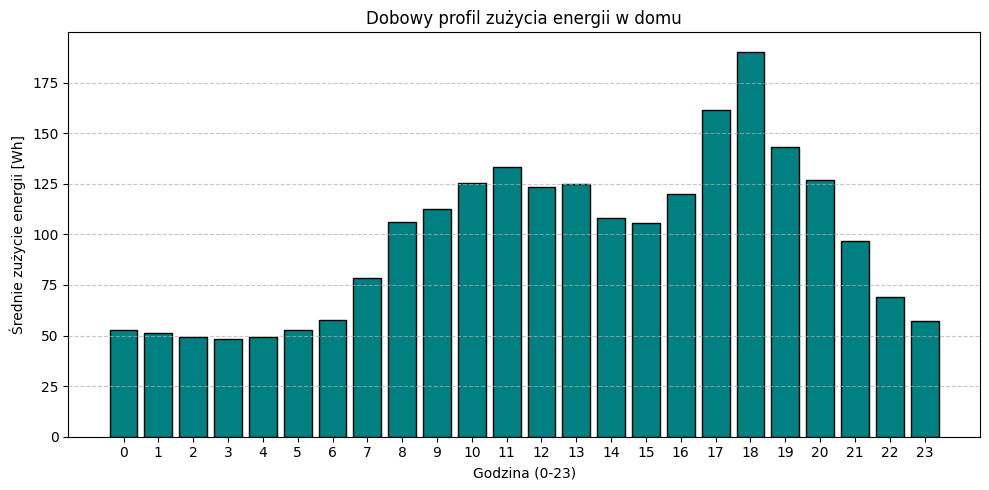
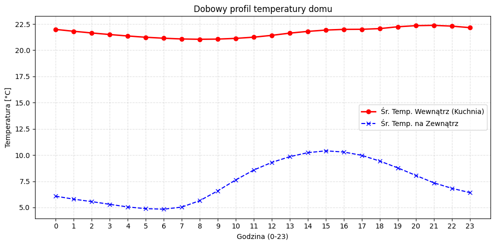
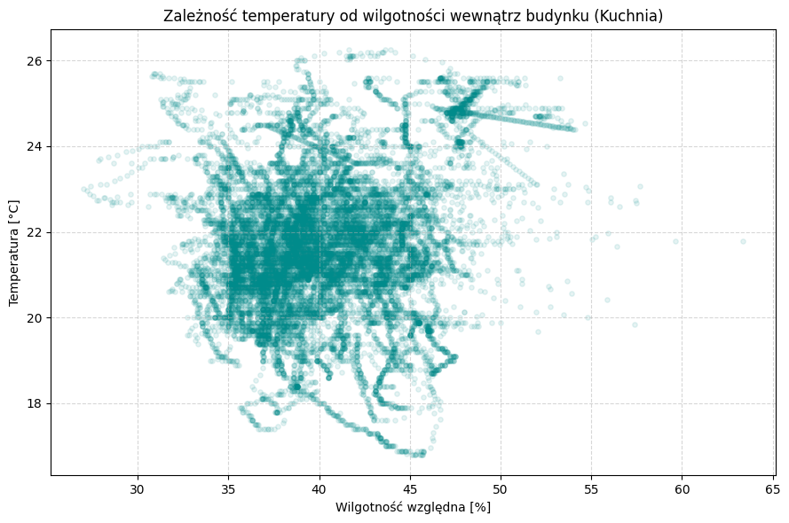
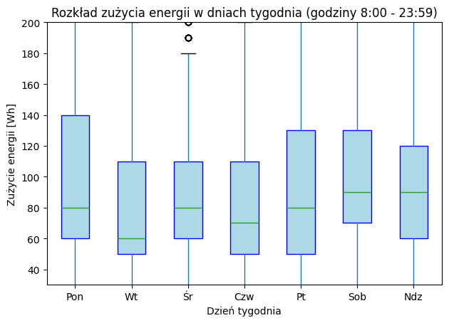

# Sprawozdanie: Analiza danych IoT - Moduł 2

## 1. O co chodzi w zadaniu?
Dostałem do analizy plik CSV z domowego systemu IoT. Jest tam prawie 20 tysięcy wpisów. Zadanie polegało na tym, żeby nie tylko to wczytać, ale przede wszystkim sensownie pokazać na wykresach, co tam się właściwie w tym domu dzieje. Użyłem do tego Pythona w VS Code (tryb Interactive), co bardzo ułatwiło sprawę, bo wykresy generowały się od razu obok kodu.

## 2. Jak "wyłuskiwałem" dane?
To była głowna część zadania. Surowe dane to był straszny szum. Żeby coś z tego wycisnąć, użyłem kilku funkcji znajdujących sie w bibliotece `pandas`:
- **Grupowanie:** Funkcją `.groupby('hour')` wrzuciłem 20 tysięcy wierszy do 24 "worków" (jeden na każdą godzinę doby) i wyciągnąłem z nich średnią.
- **Filtrowanie:** Żeby wykresy dni tygodnia miały sens, wyciąłem godziny nocne (`hour >= 8`), bo lodówka działająca w nocy tylko spłaszczała mi statystyki i zasłaniała to, jak żyją ludzie.

## 3. Omówienie wykresów

### Wykres 1 i 2: Surowy pobór energii i jego rozkład

**Mój komentarz:** Specjalnie zostawiłem te dwa wykresy, żeby pokazać, od czego zacząłem. Wykres liniowy to jedna wielka "szarpanina" – widać tylko, że co jakiś czas coś mocno żre prąd. Histogram potwierdza to samo: przez 90% czasu dom zużywa minimum (tryb czuwania), a wysokie wartości to tylko rzadkie piki. Z tych dwóch wykresów trudno wyczytać rytm dnia, dlatego musiałem wyłuskać dane.

### Wykres 3: Kiedy domownicy używają prądu? (Średnia dobowe)

**Mój komentarz:** Tu już widać konkret. Po uśrednieniu godzin widać idealnie "górkę" wieczorną między 17:00 a 20:00. To moment, kiedy wszyscy wracają, robią obiad, włączają kompy i TV. Rano też jest mały skok, pewnie na zrobienie kawy przed wyjściem.

### Wykres 4: Czy w domu jest ciepło, jak na dworze piździ?

**Mój komentarz:** Porównałem temperaturę w kuchni z tą na zewnątrz. Niebieska linia (zewnątrz) lata góra-dół, a czerwona (dom) jest stabilna jak skała. Wniosek? Dom jest bardzo dobrze odizolowany, albo ogrzewanie idealnie pilnuje temperatury, nie pozwalając jej spaść w nocy.

### Wykres 5: Gdzie domownicy czują się najlepiej? (Mapa gęstości)

**Mój komentarz:** Ten wykres (scatter/density) pokazuje, jakie warunki panują w kuchni najczęściej. Najjaśniejszy punkt to "baza": około 21 stopni i 40% wilgotności. Te rozmyte punkty na boku to pewnie momenty gotowania (robi się cieplej i paruje woda), ale widać, że to tylko chwilowe skoki i system szybko wraca do normy.

### Wykres 6: Weekendy vs Dni robocze (Aktywne godziny 8-24)

**Mój komentarz:** To mój ulubiony wykres. Odciąłem noc i pokazałem rozrzut zużycia prądu. Widać gołym okiem: od poniedziałku do piątku pudełka są małe i nisko (ludzi nie ma w domu, nic się nie dzieje). Sobota i niedziela jest bez zaskoczenia: pudełka są grube i wysoko, co oznacza, że prąd jest używany non-stop na różne sposoby.

## 4. Podsumowanie
Dzięki Pythonowi i bibliotece `pandas` udało mi się zamienić nieczytelny plik csv w konkretne wnioski o tym, jak żyją ludzie w tym domu. Najważniejsza lekcja? Surowe dane prawie zawsze kłamią albo nic nie mówią, dopóki sie ich nie odfiltruje i pogrupuje.